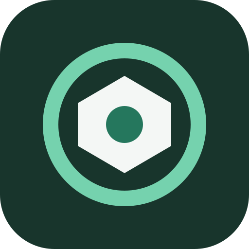
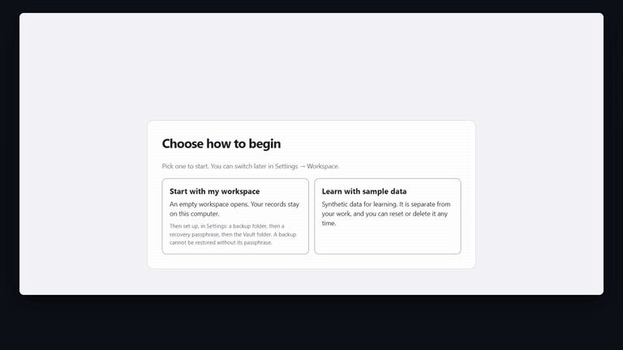
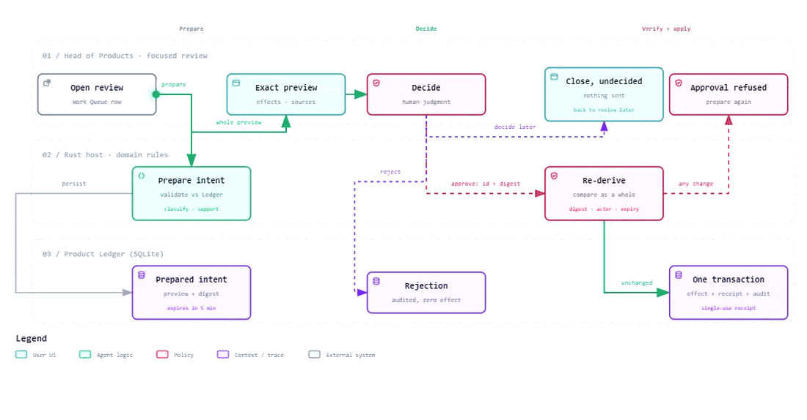
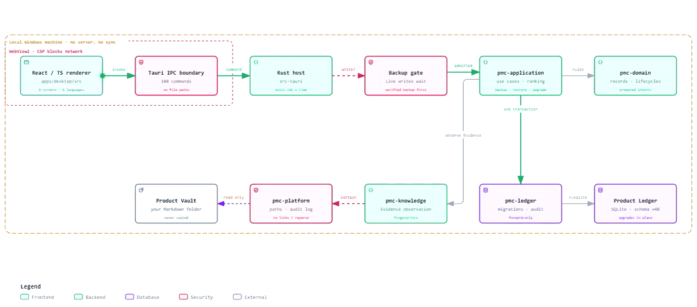
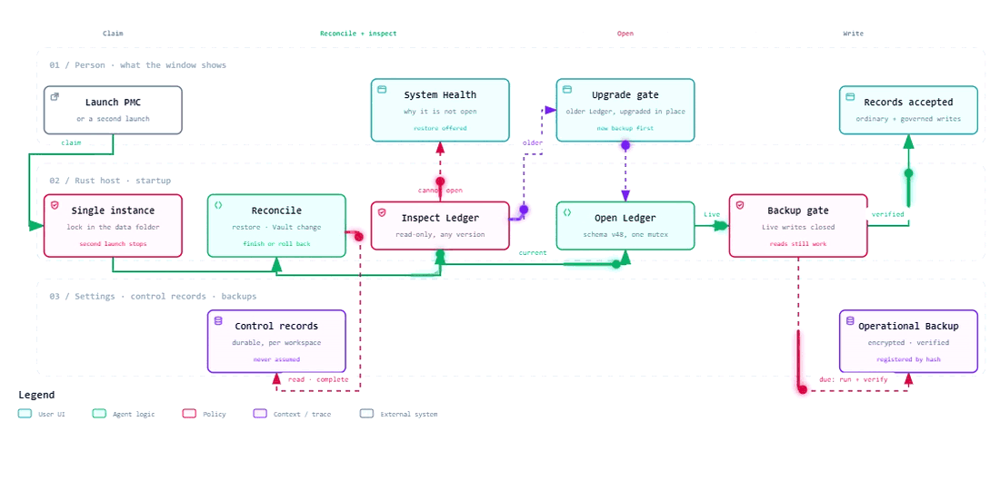
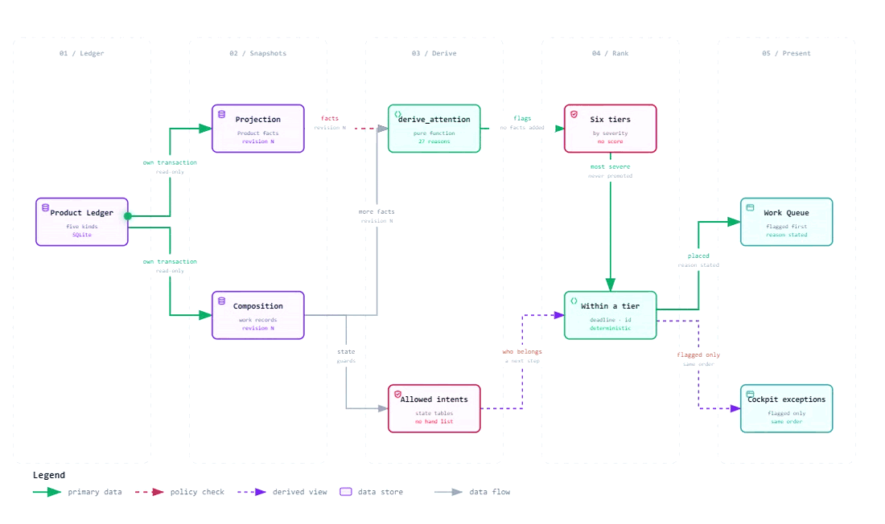
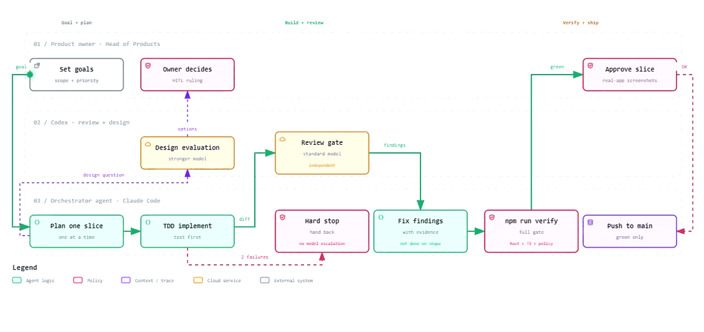

<div align="center">



# Product Mission Control

**A local-first cockpit for product leaders. It surfaces and ranks what needs attention; you decide.**

[](https://github.com/kevintu2007/product-leader-cockpit/actions/workflows/ci.yml)
[](https://github.com/kevintu2007/product-leader-cockpit/releases)
[](#get-started)
[](LICENSE)

[Download](https://github.com/kevintu2007/product-leader-cockpit/releases) ·
[User guide](docs/user-guide/walkthrough.md) ·
[How it was built](docs/engineering/story.md) ·
[Architecture](docs/architecture.md) ·
[繁體中文](README.zh-TW.md)


</div>

## What it is

Product Mission Control is a Windows desktop app for one person who runs a product portfolio. It
keeps products, commitments, decisions, risks, issues and the evidence behind them in a local
database, and shows what needs attention and why.

It works like an X-ray, not a verdict. The app places every Product on a portfolio lens, ranks the
work that needs attention with a stated reason, and prepares every material change as an exact
preview. You approve it, reject it on the record, or close it and come back later. Nothing is
decided for you, and everything runs on your own machine.

- **Ranked, with reasons.** Every item in the Work Queue says why it is where it is and which next
  steps its state allows.
- **Exact previews.** A change that needs approval is prepared first: the app names every record,
  version and new id, and the digest you approve covers all of it.
- **Evidence or Judgment.** Changes that need support rest on verified Evidence, or on a written
  Judgment you own. Evidence that was never verified cannot be vouched for. Verified means the file
  matches its pinned fingerprint; the app does not judge whether a source's claims are true.
- **Your files stay yours.** Evidence lives in a Vault folder you choose; the app records where each
  file is and its fingerprint, and never copies it.
- **Backed up before it matters.** Your workspace accepts changes only after an encrypted backup has
  verified. A backup holds the Ledger and non-secret settings, not your Vault or Evidence files, and
  it opens without PMC: decrypt with the public `age` tool, then unpack with zstd and tar.
- **Six languages.** English, 繁體中文, 简体中文, 日本語, 한국어 and Español.

## Get started

1. Download the installer and its `.sha256` file from
   [Releases](https://github.com/kevintu2007/product-leader-cockpit/releases).
2. Check the download in PowerShell; the two values must match:

   ```powershell
   (Get-FileHash .\product-mission-control_0.2.0-beta_windows-x86_64_nsis-setup.exe -Algorithm SHA256).Hash.ToLower()
   Get-Content .\product-mission-control_0.2.0-beta_windows-x86_64_nsis-setup.exe.sha256
   ```

3. Run the installer. The beta is not code-signed, so Windows SmartScreen warns: choose **More info**,
   check the file name, then **Run anyway**. It installs for your account only, with no administrator
   rights.
4. On first run, choose **Learn with sample data** to explore, or **Start with my workspace** for
   your real records. You can switch at any time in Settings.

The [user guide](docs/user-guide/walkthrough.md) walks through installing, a week on sample data,
and setting up your own workspace, one screenshot per step.

## Demo

<div align="center">
<a href="docs/media/pmc-demo.mp4"></a>
<br><sub>One minute on sample data. Select the animation for the full-quality video.</sub>
</div>

<table>
<tr>
<td width="50%"></td>
<td width="50%"></td>
</tr>
<tr>
<td><b>A ranked Work Queue</b><br><sub>Every item says why it is where it is, and which next steps its state allows.</sub></td>
<td><b>Approve an exact preview</b><br><sub>The host names every record, version and new id before anything changes.</sub></td>
</tr>
<tr>
<td></td>
<td></td>
</tr>
<tr>
<td><b>Evidence or Judgment</b><br><sub>Partly verified Evidence moves forward only with a written Judgment you own.</sub></td>
<td><b>Set up in order</b><br><sub>Your workspace lists its setup steps, each read from the real state, until all are done.</sub></td>
</tr>
</table>

## How a change is governed

<picture>
  <source media="(prefers-color-scheme: dark)" srcset="docs/media/pmc-governed-write-dark.gif">
  
</picture>

- **Prepare.** The host validates the request against the Ledger, resolves where its data
  classification comes from, checks the Evidence-or-Judgment rule, and stores an exact preview with
  a digest. Previews expire after five minutes.
- **Approve.** The host re-derives the current state and compares it with the preview as a whole.
  Any difference refuses the approval. The change, its audit event and a single-use receipt are
  written in one transaction.
- **Reject or step away.** A rejection is recorded and changes nothing. Closing the review records
  nothing, and you can return to the same preview.

## Architecture

<picture>
  <source media="(prefers-color-scheme: dark)" srcset="docs/media/pmc-architecture-dark.gif">
  
</picture>

- **Product Ledger:** a local SQLite database, the authority for structured records, audit events and
  approval receipts. Its schema only moves forward; an older supported Ledger is upgraded in place
  after a verified backup.
- **Product Vault:** a folder of Markdown and Evidence files that belongs to you. The Ledger stores
  only references, verification states and pinned fingerprints.
- **Renderer:** React and TypeScript. It has no network access and never sends or receives a file
  path; file and folder pickers are opened by the host. 108 reviewed IPC commands are the whole
  contract with the Rust host.

More in [Architecture](docs/architecture.md) and the [security model](docs/security-model.md).

## Two mechanisms, drawn from the code

**Opening a workspace.** Nothing is assumed at start-up. One instance runs per profile. An
interrupted restore or Vault change is finished or rolled back from its control record before any
file is opened. The Ledger is inspected read-only before it is opened, so an older one waits at an
upgrade gate and one that cannot open waits at System Health with restore offered. In your own
workspace, no record is accepted until an encrypted backup has verified.

<picture>
  <source media="(prefers-color-scheme: dark)" srcset="docs/media/pmc-workspace-gates-dark.gif">
  
</picture>

**What comes first.** The Work Queue and the Cockpit's exception list rank attention with six named
tiers, never a weighted score, so every position can be explained in one sentence. A missing fact
flags nothing, no deadline is invented, and stale data is never promoted. The rules are written down
in the [attention ranking](docs/policies/attention-ranking.md) and
[Work Queue ordering](docs/policies/work-queue-ordering.md) policies, and the code is checked
against them.

<picture>
  <source media="(prefers-color-scheme: dark)" srcset="docs/media/pmc-attention-ranking-dark.gif">
  
</picture>

## Where this repository comes from

This is the public edition of a tool I built for my own work. Development happens in a private
repository that also holds planning documents, design reviews, agent configuration and a daily
development journal. This repository is exported from it by an allowlist: only the application, its
tests, the build and verification scripts, and documents written for readers outside the project
are included, and a scan for private paths, names and credentials blocks the export if one slips through. The commit history is
not carried over: the first public commit is an exported release snapshot, later commits carry
public documentation and compatibility fixes, and release tags mark the published versions.

What that means for you: the code here is the code that ships, and `npm run verify` passes on this
repository on its own. Issues are welcome here; pull requests are not accepted during the beta.

## How it was built

This is a tool built for the role of Head of Products, covering a company's whole product
portfolio. The design and the decisions are mine; AI coding agents wrote most of the code under a
fixed loop: Claude Code implements one bounded change at a time, test first; Codex reviews it
independently; the full verification suite passes; I accept it from the real app.

<picture>
  <source media="(prefers-color-scheme: dark)" srcset="docs/media/pmc-how-it-was-built-dark.gif">
  
</picture>

Two of the problems that took real design work:

- Approving a change re-derives the whole snapshot and compares it as one thing, instead of
  checking one hash. An audit found seven of nine record families replaying the current state
  instead of the approved one; the fix became the rule every later mechanism follows.
- Restore replaces a live SQLite file without `unsafe` code: a two-step rename with every phase
  journaled, and a start-up that finishes or rolls back whatever a crash interrupted.

The rest, with the trade-offs behind them and what the reviews caught, is written up with dates in
the engineering story linked below.

Measured on the private repository on 24 September 2026: 472 commits over 46 days, about 113,000
lines of Rust with 80,000 more in tests, 36,000 lines of TypeScript, 1,540 Rust tests, 432 frontend
tests and 48 forward-only schema versions.
Read the full story, including what the review gates caught, in
[How this was built](docs/engineering/story.md) and
[Working with AI agents](docs/engineering/working-with-ai-agents.md).

## Status

Version 0.2.0-beta, the first release with an installer. It is ready to hold real records, with the
limits below.

<details>
<summary>What works today, and what is not built yet</summary>

**Works:** the Executive Cockpit with the Portfolio Lens and the Getting started list; Portfolio with
the Product inspector (structure, Evidence, people); creating and editing records; the Work Queue for
Action Requests, Actions, Decision Requests, Risks and Issues with governed approvals; People;
Product Vault; Evidence from a file, fingerprint pinning, re-observation and linking; encrypted
backups, restore and in-place Ledger upgrade; the sample workspace; System Health; six languages; a
per-user Windows installer.

**Not built yet:** review periods, Fact Packs and approved reports; moving an Evidence file to a new
location; code signing and automatic updates; a full Vault archive; any AI assistance inside the
app.

</details>

## Build from source

Prerequisites: Windows 11 x64 with the WebView2 Runtime, the Microsoft C++ Build Tools, Node.js
`>=24.18.0 <25` with npm `>=11.16.0 <12`, Rust 1.88.0 (pinned by `rust-toolchain.toml`), and
Python 3 for the documentation check.

```powershell
npm ci
npm run desktop:dev
```

On first run, choose **Learn with sample data** to work on the synthetic sample workspace.

<details>
<summary>Other commands</summary>

```powershell
npm run verify             # every required check; slow, most of it is the Rust test suite
npm run desktop:build      # a release executable; run inside a Git checkout
npm run desktop:release    # the installer, its .sha256 and build-inputs.json; needs a clean tree
npx playwright install chromium
npm run test:e2e           # renderer contracts in a real browser
```

</details>

## Repository map

| Path | What it holds |
| --- | --- |
| `apps/desktop/src/` | The React and TypeScript renderer: routes, sheets, and the six language catalogs |
| `apps/desktop/src-tauri/` | The Rust host: IPC commands, native dialogs, the installer template |
| `crates/pmc-domain/` | Domain types and invariants: records, lifecycles, classification, Evidence rules |
| `crates/pmc-ledger/` | The SQLite Product Ledger: schema, forward-only migrations, inspection and upgrade |
| `crates/pmc-application/` | Workflows across the domain: compositions, governed writes, backup, restore, the sample |
| `crates/pmc-platform/` | Operating-system adapters: paths, settings, credentials, backup archives, audit log |
| `crates/pmc-knowledge/` | The Product Vault: configuration, health and Evidence observation |
| `tools/pmc-seed/` | A developer command that rebuilds the sample workspace |
| `scripts/verify/` | `npm run verify`, the policy checks and their negative fixtures |
| `scripts/build/` | The desktop and installer build |
| `docs/` | Architecture, security model, decisions, policies, the UI contract and the user guide |

## Documentation

| | |
| --- | --- |
| [User guide](docs/user-guide/walkthrough.md) | Install, a week on sample data, your own workspace ([繁體中文](docs/user-guide/walkthrough.zh-TW.md)) |
| [How this was built](docs/engineering/story.md) | The story, timeline, and what the reviews caught |
| [Working with AI agents](docs/engineering/working-with-ai-agents.md) | Roles, routing, rules and gates |
| [Architecture](docs/architecture.md) | Crates, IPC boundary, authority split, governed writes |
| [Security model](docs/security-model.md) | Local-first threat model, data locations, backups and the installer |
| [UI contract](docs/ui-contract.md) | Every screen and its states as shipped |
| [Domain glossary](docs/domain-glossary.md) | The vocabulary of the domain |
| [Design system](docs/design-system.md) | Tokens, type, colour and accessibility |
| [Policies](docs/policies/attention-ranking.md) | Attention ranking and [Work Queue ordering](docs/policies/work-queue-ordering.md) |
| [Decisions](docs/decisions/README.md) | Architecture decision records |
| [Changelog](CHANGELOG.md) | What changed in each version |

## Contributing and security

Issues are welcome; see [CONTRIBUTING.md](CONTRIBUTING.md). Pull requests are not accepted during
the beta. Report vulnerabilities privately as described in [SECURITY.md](SECURITY.md), and follow
the [Code of Conduct](CODE_OF_CONDUCT.md).

## Author

Created and maintained by **Kevin Yu-chang Tu**<br>
**Polatouche.K** · [@kevintu2007](https://github.com/kevintu2007) · [LinkedIn](https://www.linkedin.com/in/kevin-yu-chang-tu-a19b8469)

## License

Source-available under the [PolyForm Noncommercial License 1.0.0](LICENSE). You may use, study and change it for personal, research, educational and other noncommercial purposes. Commercial use requires a separate license; contact the author through [GitHub](https://github.com/kevintu2007). Third-party components keep their own licenses; see [NOTICE](NOTICE).
