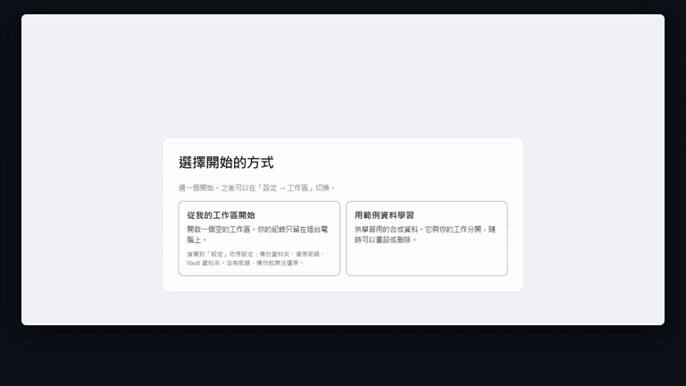

<div align="center">


# Product Mission Control

**給產品負責人的本機駕駛艙：它揭露並排序需要注意的事，由你決定。**

[](https://github.com/kevintu2007/product-leader-cockpit/actions/workflows/ci.yml)
[](https://github.com/kevintu2007/product-leader-cockpit/releases)
[](#開始使用)
[](LICENSE)

[下載](https://github.com/kevintu2007/product-leader-cockpit/releases) ·
[使用手冊](docs/user-guide/walkthrough.zh-TW.md) ·
[這個專案是怎麼做出來的](docs/engineering/story.zh-TW.md) ·
[架構](docs/architecture.md) ·
[English](README.md)


</div>

## 這是什麼

Product Mission Control 是一個 Windows 桌面應用程式，給一個負責產品組合的人使用。它把產品、承諾、
決策、風險、問題，以及支撐它們的證據，存在本機的資料庫裡，並告訴你哪些事需要注意、為什麼。

它像 X 光片，不是判決書。app 把每個 Product 放在 Portfolio Lens 上，把需要注意的工作依明說的理由
排序，並把每一個重要變更準備成一份精確的預覽。你可以核准、正式拒絕，或先關掉、之後再回來。沒有
任何事會替你決定，一切都在你自己的電腦上執行。

- **排序，並說明理由。** Work Queue 的每一項都寫出為什麼排在這裡，以及目前狀態允許哪些下一步。
- **精確的預覽。** 任何東西改變之前，app 先列出每一筆紀錄、版本與新 id，你核准的摘要涵蓋全部內容。
- **Evidence 或 Judgment。** 需要依據的變更，要有已驗證的 Evidence，或你寫下並負責的 Judgment；
  從未驗證的 Evidence，任何判斷都無法替它背書。
- **檔案留在你手上。** Evidence 放在你選的 Vault 資料夾；app 只記錄每個檔案的位置與指紋，不複製
  檔案。
- **重要之前先備份。** 你的工作區要等加密備份驗證通過後才接受變更；備份可以用公開的 `age` 工具
  還原。
- **六種語言。** English、繁體中文、简体中文、日本語、한국어、Español。

## 開始使用

1. 從 [Releases](https://github.com/kevintu2007/product-leader-cockpit/releases) 下載安裝程式與它的
   `.sha256` 檔。
2. 在 PowerShell 核對下載的檔案，兩個值必須相同：

   ```powershell
   (Get-FileHash .\product-mission-control_0.2.0-beta_windows-x86_64_nsis-setup.exe -Algorithm SHA256).Hash.ToLower()
   Get-Content .\product-mission-control_0.2.0-beta_windows-x86_64_nsis-setup.exe.sha256
   ```

3. 執行安裝程式。beta 版沒有程式碼簽章，Windows SmartScreen 會警告：按 **其他資訊**，確認檔名，再按
   **仍要執行**。它只為你的帳戶安裝，不需要系統管理員權限。
4. 第一次啟動時，選 **用範例資料學習** 來熟悉操作，或選 **從我的工作區開始** 存放真正的紀錄。之後
   隨時可以在設定裡切換。

[使用手冊](docs/user-guide/walkthrough.zh-TW.md)一步一張截圖，帶你走過安裝、範例資料的一週，以及
設定自己的工作區。

## 示範

<div align="center">
<a href="docs/media/pmc-demo.zh-TW.mp4"></a>
<br><sub>一分鐘，使用範例資料。點動畫可看完整畫質的影片。</sub>
</div>

<table>
<tr>
<td width="50%"></td>
<td width="50%"></td>
</tr>
<tr>
<td><b>排序過的 Work Queue</b><br><sub>每一項都說明為什麼排在這裡，以及目前狀態允許哪些下一步。</sub></td>
<td><b>核准一份精確的預覽</b><br><sub>任何東西改變之前，主機先列出每一筆紀錄、版本與新 id。</sub></td>
</tr>
<tr>
<td></td>
<td></td>
</tr>
<tr>
<td><b>Evidence 或 Judgment</b><br><sub>只驗證了一部分的 Evidence，要有你寫下並負責的 Judgment 才能往前。</sub></td>
<td><b>依序設定</b><br><sub>你的工作區會列出設定步驟，每一步都讀自真實狀態，全部完成才消失。</sub></td>
</tr>
</table>

## 一個變更如何被治理

<picture>
  <source media="(prefers-color-scheme: dark)" srcset="docs/media/pmc-governed-write-dark.gif">
  
</picture>

- **準備：** 主機依 Ledger 驗證請求、找出資料分級的來源、檢查 Evidence 或 Judgment 規則，並存下附
  摘要的精確預覽。預覽五分鐘後失效。
- **核准：** 主機重新推導目前的狀態，和預覽整體比對；只要有任何不同就拒絕核准。變更、稽核事件與
  單次使用的收據在同一個交易裡寫入。
- **拒絕或先離開：** 拒絕會被記錄，但不改變任何東西；關掉審閱單什麼都不記錄，之後可以回到同一份
  預覽。

## 架構

<picture>
  <source media="(prefers-color-scheme: dark)" srcset="docs/media/pmc-architecture-dark.gif">
  
</picture>

- **Product Ledger：** 本機的 SQLite 資料庫，是結構化紀錄、稽核事件與核准收據的權威來源。schema
  只能往前；較舊但仍支援的 Ledger 會在備份驗證通過後就地升級。
- **Product Vault：** 屬於你的 Markdown 與 Evidence 資料夾。Ledger 只存參照、驗證狀態與釘選的指紋。
- **介面：** React 與 TypeScript，沒有網路存取，也從不傳送或接收檔案路徑；選擇檔案與資料夾的視窗由
  主機開啟。108 個經過審查的 IPC 指令就是它和 Rust 主機之間的全部契約。

更多內容見[架構](docs/architecture.md)與[安全模型](docs/security-model.md)（英文）。

## 兩個機制，直接從程式碼畫出來

**開啟工作區。** 啟動時什麼都不假設。每個設定檔只跑一個實例；上次被中斷的還原或 Vault 變更，會先依
它的控制紀錄完成或退回，才開任何檔案。Ledger 先以唯讀方式檢查再開啟：較舊的停在升級閘門，打不開的
停在 System Health 並提供還原。在你自己的工作區，加密備份驗證通過之前，不接受任何紀錄。

<picture>
  <source media="(prefers-color-scheme: dark)" srcset="docs/media/pmc-workspace-gates-dark.gif">
  
</picture>

**什麼排在前面。** Work Queue 與 Cockpit 的例外清單用六個具名層級排序，而不是加權分數，所以每個位置
都能用一句話解釋。缺少的事實不會產生標記，不會編造期限，過期的資料也不會被往前排。規則寫在
[注意力排序](docs/policies/attention-ranking.md)與
[Work Queue 排序](docs/policies/work-queue-ordering.md)兩份政策（英文），程式碼依此檢查。

<picture>
  <source media="(prefers-color-scheme: dark)" srcset="docs/media/pmc-attention-ranking-dark.gif">
  
</picture>

## 這個 repo 從哪裡來

這是我替自己工作做的工具的公開版。開發在一個私有 repo 進行，那裡還放著規劃文件、設計審查、agent
設定與每日開發日誌。這個 repo 由私有 repo 依允許清單匯出：只收錄 app 本身、它的測試、建置與驗證
腳本，以及寫給專案外讀者的文件；另有一道掃描檢查私人路徑、姓名與憑證，一旦發現就中止匯出。commit
歷史不會帶過來，所以每一個公開 commit 都是一次發布快照。

對你來說，這代表：這裡的程式碼就是實際出貨的程式碼，而且 `npm run verify` 在這個 repo 單獨就能
通過。歡迎在這裡開 issue；beta 期間不接受 pull request。

## 怎麼做出來的

這個工具是為 Head of Products 這個角色做的，對象是公司的整個產品組合。它是我帶著 AI coding agent，在我訂下並執行的
規則下做出來的：Claude Code 一次只寫一小片，而且先寫測試；Codex 獨立審查每一片；完整驗證沒通過、
我沒看過真實 app 的截圖並接受之前，任何東西都不會進主線。

<picture>
  <source media="(prefers-color-scheme: dark)" srcset="docs/media/pmc-how-it-was-built-dark.gif">
  
</picture>

這不是一個週末做出來的東西。幾個真的花了設計功夫的問題，每一個都經過獨立審查，並留下書面決定：

- 備份閘門要在整個交易期間持有一把鎖，第一版把自己的測試鎖死了。「連續失敗兩次就停」的規則
  中止了第一次嘗試；重新設計後拆成一把准入鎖與一把狀態鎖。
- 還原要在不用 `unsafe` 的前提下換掉正在使用的 SQLite 檔案：兩段式改名、每個階段都寫日誌，啟動時
  把當機打斷的事做完或退回。
- 核准一個變更時，重新推導整份快照，而不是只比對一個雜湊。一次稽核發現九類紀錄裡有七類重放的是
  「現在」的狀態，而不是核准當下的狀態。
- 驗證套件每次寫入都從 46 個 migration 重建正典 schema。改成每個程序只算一次，Rust 測試時間少了
  三分之二。

46 天、472 個 commit、約 113,000 行 Rust 加上 80,000 行 Rust 測試、36,000 行 TypeScript、1,540 個
Rust 測試、432 個前端測試、48 個只能前進的 schema 版本。完整的故事，包括審查關卡抓到了什麼，寫在[這個專案是怎麼做出來的](docs/engineering/story.zh-TW.md)與
[Working with AI agents](docs/engineering/working-with-ai-agents.md)（英文）。

## 目前狀態

0.2.0-beta 版，第一個附安裝程式的版本，可以存放真正的紀錄，限制如下。

<details>
<summary>現在能用的，以及還沒做的</summary>

**能用：** Executive Cockpit、Portfolio Lens 與開始使用清單；Portfolio 與 Product 檢視面板（結構、
Evidence、人員）；建立與編輯紀錄；Work Queue，涵蓋 Action Request、Action、Decision Request、Risk
與 Issue 的受管核准；People；Product Vault；從檔案新增 Evidence、指紋釘選、重新觀察與連結；加密
備份、還原與 Ledger 就地升級；範例工作區；System Health；六種語言；以使用者帳戶安裝的 Windows
安裝程式。

**還沒做：** 檢視期間、Fact Pack 與核准後的報告；把 Evidence 檔案搬到新位置；程式碼簽章與自動
更新；完整的 Vault 封存；app 內的任何 AI 輔助。

</details>

## 從原始碼建置

需要：Windows 11 x64 與 WebView2 Runtime、Microsoft C++ Build Tools、Node.js `>=24.18.0 <25` 與
npm `>=11.16.0 <12`、Rust 1.88.0（由 `rust-toolchain.toml` 固定），以及用於文件檢查的 Python 3。

```powershell
npm ci
npm run desktop:dev
```

第一次啟動時選 **用範例資料學習**，就會在合成的範例工作區上操作。

<details>
<summary>其他指令</summary>

```powershell
npm run verify             # 所有必要檢查；很慢，大部分時間在 Rust 測試
npm run desktop:build      # 建置 release 執行檔；需在 Git checkout 內執行
npm run desktop:release    # 安裝程式、它的 .sha256 與 build-inputs.json；工作樹必須乾淨
npx playwright install chromium
npm run test:e2e           # 在真實瀏覽器裡檢查介面契約
```

</details>

## Repo 地圖

| 路徑 | 內容 |
| --- | --- |
| `apps/desktop/src/` | React 與 TypeScript 介面：畫面、審閱單，以及六種語言的文字 |
| `apps/desktop/src-tauri/` | Rust 主機：IPC 指令、原生對話框、安裝程式範本 |
| `crates/pmc-domain/` | 領域型別與不變條件：紀錄、生命週期、資料分級、Evidence 規則 |
| `crates/pmc-ledger/` | SQLite Product Ledger：schema、只能往前的遷移、檢查與升級 |
| `crates/pmc-application/` | 跨領域的工作流程：組合讀取、受管寫入、備份、還原、範例工作區 |
| `crates/pmc-platform/` | 作業系統介接：路徑、設定、憑證、備份封存、稽核紀錄 |
| `crates/pmc-knowledge/` | Product Vault：設定、健康狀態與 Evidence 觀察 |
| `tools/pmc-seed/` | 開發用指令，重建範例工作區 |
| `scripts/verify/` | `npm run verify`、政策檢查與它們的反向測試資料 |
| `scripts/build/` | 桌面程式與安裝程式的建置 |
| `docs/` | 架構、安全模型、決策紀錄、政策、UI 契約與使用手冊 |

## 文件

| | |
| --- | --- |
| [使用手冊](docs/user-guide/walkthrough.zh-TW.md) | 安裝、範例資料的一週、你自己的工作區（[English](docs/user-guide/walkthrough.md)） |
| [這個專案是怎麼做出來的](docs/engineering/story.zh-TW.md) | 故事、時間軸，以及審查抓到了什麼 |
| [Working with AI agents](docs/engineering/working-with-ai-agents.md) | 角色、路由、規則與關卡（英文） |
| [Architecture](docs/architecture.md) | crate、IPC 邊界、權責分工、受管寫入（英文） |
| [Security model](docs/security-model.md) | 本機優先的威脅模型、資料位置、備份與安裝程式（英文） |
| [UI contract](docs/ui-contract.md) | 每個畫面與其狀態（英文） |
| [Domain glossary](docs/domain-glossary.md) | 領域用語（英文） |
| [Design system](docs/design-system.md) | token、字體、色彩與無障礙（英文） |
| [Policies](docs/policies/attention-ranking.md) | 注意排序與 [Work Queue 排序](docs/policies/work-queue-ordering.md)（英文） |
| [Decisions](docs/decisions/README.md) | 架構決策紀錄（英文） |
| [Changelog](CHANGELOG.md) | 每個版本的變更（英文） |

## 參與與資安

歡迎開 issue，詳見 [CONTRIBUTING.md](CONTRIBUTING.md)。beta 期間不接受 pull request。資安問題請依
[SECURITY.md](SECURITY.md) 私下回報，並遵守[行為準則](CODE_OF_CONDUCT.md)。

## 作者

Created and maintained by **Kevin Yu-chang Tu**<br>
**Polatouche.K** · [@kevintu2007](https://github.com/kevintu2007) · [LinkedIn](https://www.linkedin.com/in/kevin-yu-chang-tu-a19b8469)

## 授權

以 [PolyForm Noncommercial License 1.0.0](LICENSE) 公開原始碼（source-available）：個人、研究、教育與其他非商業用途都可以使用、研究與修改。商業使用需要另外取得授權，請透過 [GitHub](https://github.com/kevintu2007) 聯絡作者。第三方元件維持各自的授權，見 [NOTICE](NOTICE)。
