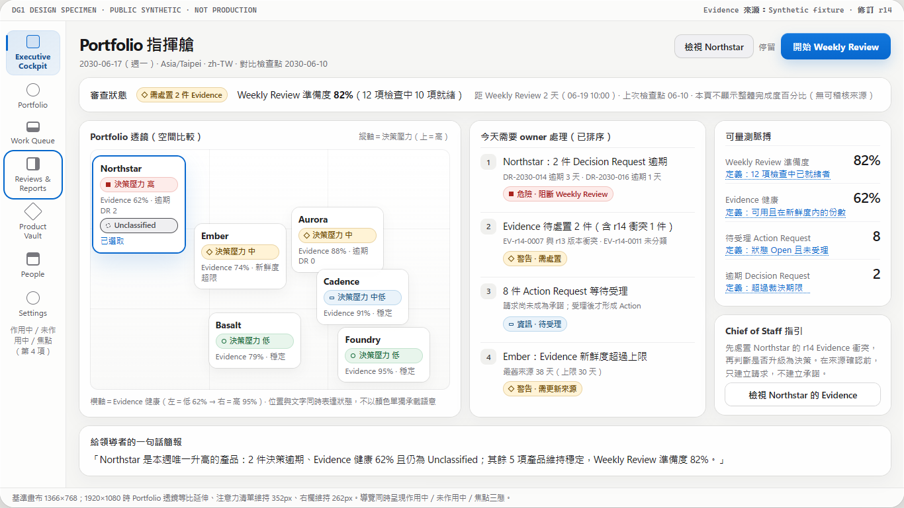
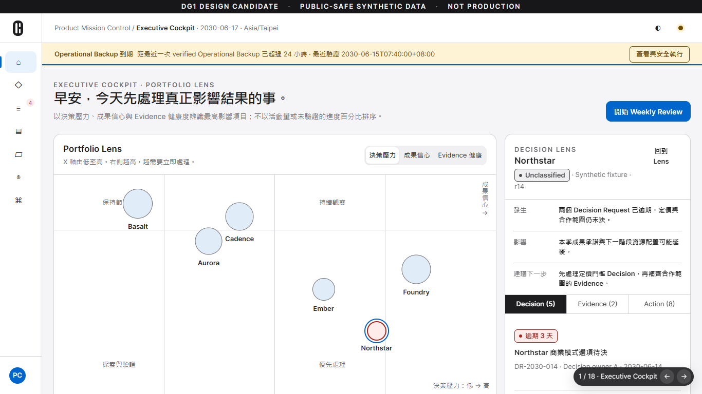
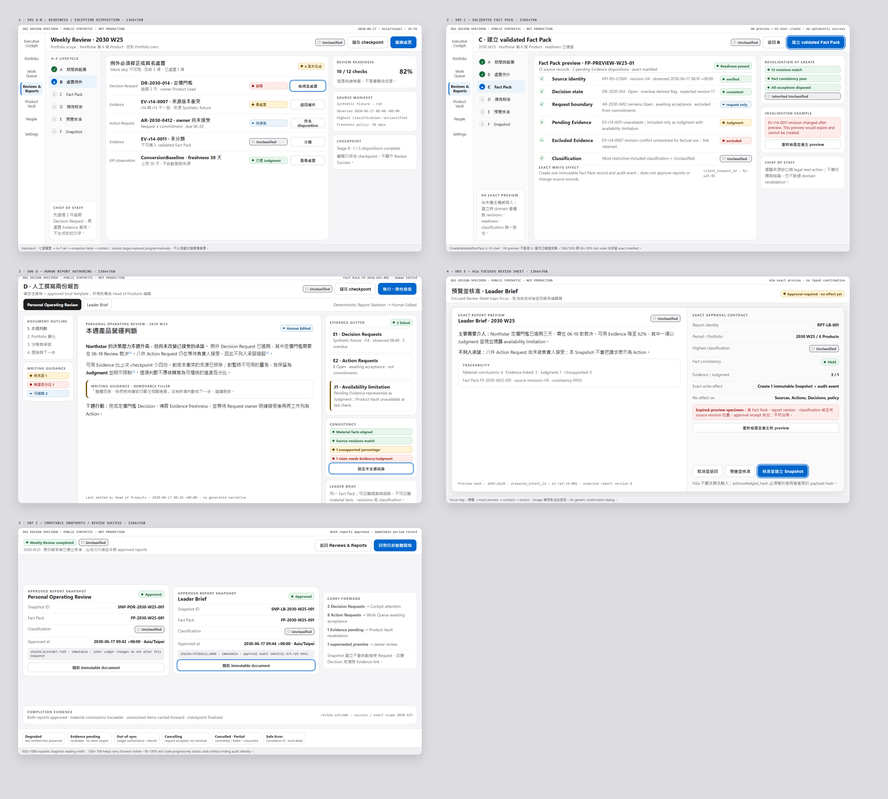

# 這個專案是怎麼做出來的

[English](story.md)

這個系統是為 Head of Products 這個角色設計的。Product Mission Control 是我為這個角色做的工具：一個人
要看整個產品組合，得同時掌握每個產品和專案的方向、成果、交付承諾、決策、風險，還有支撐每一個判斷
的證據。它先在我的私人 repo 裡開發了一個多月，各項機制在過程中反覆調整、驗證，最後整理成這個公開的 repo，讓別人看得到它怎麼運作，也看得到
它是怎麼做出來的。

## 為什麼要做

我的工作，是把產品方向、成果、交付承諾、決策、風險，還有支撐這些判斷的證據，連成一張完整的圖。
但現實是這些資訊散落在任務工具、文件、儀表板和會議紀錄裡：全貌很快就過時，光是整理狀態報告，就吃掉
原本該用來做決策的時間。

我想要的是一個放在自己電腦上的工作空間，它對產品組合的作用，就像 X 光片之於醫生：告訴你該看哪裡、
哪些事最需要注意、為什麼，但診斷還是由人來下。每一個重要的變更都要先看到精確的預覽，由我核准或
拒絕；每一個結論，不是有 Evidence 支撐，就是我親手寫下、自己負責的 Judgment。

從這裡定下三條原則：

- 系統負責找出來、排好序；決定的人是我。沒有任何東西會替我按下核准。
- 沒有事情會悄悄消失。拒絕會留下紀錄；還沒決定就把審閱單關掉，不會被當成決定記下來。
- 永遠留一條路走。規則再嚴，也不能把工作卡死：Evidence 只驗證了一部分，寫下 Judgment 就能往前走；
  完全沒驗證過的 Evidence 就不行。

## 先想清楚，再動手

我先把設計和架構想清楚，再讓它們引導開發：這個產品要解決什麼、資料的隱私邊界在哪、領域裡的名詞
怎麼定義、架構怎麼分層、錯誤怎麼處理、用什麼指令驗證、審查流程怎麼走。第一週我先把這份專案地基
建起來，用的是我之前公開的 agent skill
[Project Kickoff Foundation](https://github.com/kevintu2007/project-kickoff-foundation)，每一項都標明
已確認、提議中或待決。之後的開發，都以這份地基為準。

接著是設計，分成幾道關卡：先有概念，再來是附互動原型的設計簡報，最後是一份 UI 契約。這份契約在
2026 年 8 月 15 日凍結，兩天後才寫下第一行應用程式碼。

  

Portfolio 畫面早期的設計稿。每個數字都帶著自己的定義，沒有說出理由就不排序。

<table>
<tr>
<td width="50%"></td>
<td width="50%"></td>
</tr>
<tr>
<td>Executive Cockpit 的互動原型。</td>
<td>實際做出來的 Cockpit。Lens 的座標軸改過：原本的「決策壓力」這一軸，我發現在資料裡找不到能誠實逐個 Product 算出來的來源。</td>
</tr>
</table>

這種改法在這個專案裡很常見：當凍結的設計要求一個領域模型算不出來的數字，改的是設計，而且寫成正式
的修訂；不會讓軟體硬編一個數字出來。

## 我怎麼帶 AI agent 工作

方向和決策由我負責，程式大部分由 AI agent 來寫。完整做法寫在
[Working with AI agents](working-with-ai-agents.md)（英文），重點如下：

- **Claude Code** 是 orchestrator：一次只規劃、實作一小片，而且先寫測試。
- **Codex** 是獨立的審查者：一般變更用標準模型審查，架構與機制設計交給更強的模型評估。寫程式的
  那一方，永遠不能核准自己寫的東西。
- 本地模型處理範圍明確、低風險的工作。
- 能做決定的只有我：目標由我設定，會動到規則的問題由我回答，使用者看得到的每一片功能，我都要看過
  真實 app 的截圖才接受。

讓這一切保持誠實的規則不多：地基凍結後只能往裡面填，不能改；測試連續失敗兩次就停下來交回給我；
agent 不能自己開 issue、不能自己擴大範圍；任何東西都不能因為「結構看起來完整」就說做完了。

## 審查關卡抓到了什麼

審查不是走過場。下面幾個發現，都在繼續往下做之前就修好了：

- **8 月 13 日，設計審查：** 在原型裡寫報告寫到一半，畫面一重新渲染，還沒存的文字就不見了。
- **8 月 27 日，整合審查：** 重新處理一個 Issue 時，會把過期的 Evidence 一起附上；重放的稽核事件則
  帶錯了 correlation id。修好之後，把修正拿掉，新寫的測試又會失敗，證明這個修正不是多餘的。
- **8 月 31 日，里程碑結案前的審查：** 重放一個已核准的變更時，讀的是紀錄「現在」的樣子，而不是
  「核准當下」的樣子，所以只要事後再編輯過，重啟就會壞掉。後續稽核在九類紀錄裡的七類找到同樣的
  缺口，全部修掉。
- **9 月 5 日，受管投影的稽核：** 有一個已核准的雜湊值，從來沒有真的拿去比對過；另外有一個「已同步」
  的狀態，沒有任何上線的程式碼走得到。這次稽核替專案留下最重要的一條規則：不能因為某個需求的
  「形狀」在那裡，就說它已經滿足了；要確認真的有程式碼產生它、也有程式碼強制它。修法是把預期結果
  重新推導一遍，整份拿來比對。
- **9 月 17 日，準備這個公開 repo：** 拍教學截圖的時候，發現有個畫面寫入之後還停在舊數字；匯出前的
  審查則發現程式註解裡到處是內部任務編號。兩個都在公開前修好。

## 難題

上面那些是審查抓到的正確性問題。下面這些則是真的要花設計功夫的：每一個都先由審查者評估，我再做出
書面決定，然後才動手。

- **重放「核准當下」，不是「現在」（8/31–9/2）。** 核准一個準備好的變更時，必須把整份快照重新推導
  出來，和預覽當成一個整體來比對。最早的實作重放的是紀錄現在的樣子，稽核在九類紀錄裡的七類找到
  這個缺口。這個修法後來變成一條規則，之後每個機制都照著做。
- **解釋得出來的排序（9 月）。** Work Queue 先分六個有名字的層級，再比最早的期限，最後才比類型和
  識別碼。沒有加權分數，所以每一個位置都能用一句話講清楚；新增一種需要注意的原因時，沒給它層級就
  編譯不過。書面版本是[注意力排序](../policies/attention-ranking.md)政策（英文）。
- **驗證快了三倍（9/19）。** 原本每一次寫入交易，都要先從全部 46 個 migration 重建一份正典 schema，
  再和實際的 schema 比對。改成每個程序只算一次，測試設定裡也改用最佳化編譯的 SQLite 之後，四個
  代表性的測試執行檔從 914 秒降到 294 秒；完整的 `npm run verify` 從大約 155 分鐘變成 36 到 46 分鐘。
  先量測，再決定。
- **歷史不隨 Evidence 失效（9/19）。** Issue 已經執行過的歷史，原本是用 Evidence「現在」的驗證狀態
  重建的，所以只要 Evidence 事後失去驗證，整個 Issue 快照就載入不了。現在改讀當初準備那次轉移時就
  存下來的 prepared-intent 快照；有兩個測試在舊的解碼器上會失敗。
- **重啟也不會重複建立（9/22）。** 建立紀錄時，會先用表單的請求 id，在一個獨立的交易裡把識別碼持久
  地保留下來，所以就算 app 重啟後再重試，指到的還是同一筆紀錄，不會多出第二筆。「已經保留」這件事
  的證明是一個型別，Ledger crate 以外的程式碼造不出來。
- **備份閘門（9/22）。** 在自己的工作區裡，加密備份還沒驗證通過之前，一般寫入一律不收，而且這道
  閘門要在整個交易期間都握著。第一版設計把自己的測試鎖死了；「連續失敗兩次就停」的規則讓它停下來、
  交回給我。和審查者一起重新設計後，拆成一把准入鎖和一把只握很短時間的狀態鎖，每次備份拿一張用完
  會自己釋放的票。
- **不用 `unsafe` 的還原（9/22）。** 要在 Windows 上安全地換掉使用中的 SQLite 檔案，設計成兩段式
  改名，每一個階段都寫進控制紀錄；啟動時會把被當機打斷的事做完或退回，絕對不會打開一個換到一半的
  Ledger。審查跑了四輪：第一輪就有八個發現，後面又抓到一個不是 compare-and-set 的退回階段，還有
  一條可能打開半換檔案的啟動路徑。
- **就地升級（9/22）。** 比較舊的 Ledger 先用唯讀方式檢查，把它當成關閉的檔案備份並驗證，再在一個
  交易裡升級：`BEGIN` 之前關掉外鍵，commit 之前做外鍵檢查。審查找到一個可以偽造的備份證明和一張
  可以重放的收據，兩個都在做畫面之前補好。
- **路徑不跨越邊界（9/21–9/23）。** 選檔案和資料夾的視窗由主機開；介面只拿到一個不透明、會過期的
  token，加上一個用來顯示的名稱。路徑包含檢查會拒絕連結和 reparse point；整個程式碼裡唯一一處
  `unsafe`，是用 Windows 自己的方式比較路徑名稱。還沒解的也寫下來：有一段只有 Windows API 才關得上
  的 time-of-check 空窗，列為已知限制，不藏。

## 從私人 repo 到這個 repo

私人 repo 保留完整的歷史、agent 指示和審查紀錄。這個 repo 是從它單向匯出來的：只放白名單裡的產品
檔案，文件照著現在的程式碼重寫，再用掃描擋掉任何帶有私人路徑、地址或內部參照的檔案。公開前也把
程式註解全部改寫過，讓每一則註解用文字說明它的需求，而不是指向某個內部任務。

現在是 beta：第一個有安裝程式、有加密備份與還原、可以放真正紀錄的版本。設計裡的檢視期間、Fact Pack、
核准後的報告快照都還沒做，app 裡也還沒接任何 AI 助理。[README](../../README.zh-TW.md) 列的就是今天
能用的部分。

  

設計好了、還沒做：Weekly Review 流程，從處置例外、驗證過的 Fact Pack、我自己寫的報告，到精確預覽核准與不可變快照。

## 時間軸

| 日期（2026） | 里程碑 |
| --- | --- |
| 8/10 | 專案地基、領域語言與第一批設計規格 |
| 8/12–8/15 | 設計簡報與互動原型；UI 契約凍結；設定 agent 角色與審查路由 |
| 8/17 | 第一批應用程式碼：經驗證的 Tauri 桌面工作區 |
| 8/18 | SQLite 上的 Product Ledger，從第一版 schema 起就預設拒絕 |
| 8/24–8/29 | 持久化的生命週期、每個指令的真實寫入、Evidence 與 Vault 層 |
| 8/31–9/2 | 核准、完成與取代流程；審查找出並修正重放缺口 |
| 9/3–9/7 | 桌面端第一次端到端讀取；Cockpit、Portfolio、People 與 Work Queue |
| 9/8–9/12 | 合成訓練資料、介面上的受管寫入流程、Risk 與 Issue 生命週期 |
| 9/14–9/17 | 依設計重建介面、第一版使用指南，以及第一次公開匯出 |
| 9/19 | 六種介面語言；Work Queue 以標題顯示 Risk |
| 9/21–9/24 | 加密備份、還原與 Ledger 就地升級；建立紀錄；Vault 資料夾與從檔案建立 Evidence；範例工作區；Windows 安裝程式；開始使用清單 |

## 數字

2026 年 9 月 24 日在私人 repo 上量測：

- 46 天內 472 個 commit
- 約 113,000 行 Rust，另有 80,000 行 Rust 測試分布在 152 個測試檔；約 36,000 行 TypeScript，
  41 個測試檔
- 1,540 個 Rust 測試與 432 個前端測試，全部由 `npm run verify` 執行
- 48 個只能前進的 Ledger schema 版本
- 視窗與 Rust 主機之間 108 個 IPC 指令
- 英文訊息目錄 1,383 個 key，另外翻成五種語言
- 私人 repo 裡有 27 篇開發日誌、17 份規格、12 份設計審查與 14 份決策紀錄；其中 11 份決策紀錄
  收錄在本 repo

| 週（2026） | commit 數 |
| --- | --- |
| 8/10–8/16 | 34 |
| 8/17–8/23 | 58 |
| 8/24–8/30 | 138 |
| 8/31–9/6 | 100 |
| 9/7–9/13 | 37 |
| 9/14–9/20 | 23 |
| 9/21–9/24 | 82 |

## 作者

Created and maintained by **Kevin Yu-chang Tu** 
**Polatouche.K** · [@kevintu2007](https://github.com/kevintu2007) · [LinkedIn](https://www.linkedin.com/in/kevin-yu-chang-tu-a19b8469)
